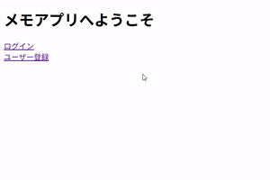

# メモアプリ (Webアプリ)

SSのDB学習として作成した、 
Web上で動くメモアプリです。

[概要](#概要)｜
[要件](#要件)｜
[使用環境と技術](#使用環境と技術)｜
[実行イメージ](#実行イメージ)｜
[工夫した点](#工夫した点)｜
[苦労や学び](#苦労や学び)｜
[その他](#その他)
 

## 概要 
・SS学習開始約2か月半後にEclipseで作成したプログラムです。 
・理解を深める目的として作成した、 
　Web上で動作するメモアプリです。 
・「掲示板アプリ」の改善点を踏まえ、作成しました。 
・Java（servlet、model、dao）とJSPを中心に、 
　HTML / CSS / JavaScript を組み合わせ、 
　DBとの連携を意識して実装しました。 
　（HTML＆CSS学習約1カ月、JavaScript学習1カ月） 
　　　> [▲ トップへ戻る](#top)

## 要件 
・ メモ表示・各種機能 
1. ユーザー登録機能 
1. ログイン機能 
1. ログオフ機能 
1. メモ一覧表示
1. メモ新規追加機能 
1. メモ編集機能 
1. メモ削除機能 
1. メモ並べ替え機能 
1. メモ検索機能 
1. アカウント削除機能 
　> [▲ トップへ戻る](#top)

## 使用環境と技術 
・言語等：Java（servlet、model、dao）、JSP、CSS、JavaScript、SQL 
・実行環境：Web　（h2コンソールを使用） 
・使用技術： 
　フォーム送信による値の受け渡し・取得 
　セッションスコープによる、ログイン状態管理 
　if文 
　for文 
　リスト 
　画面表示制御 
　try/catch文 
　データベースへ接続・SQL文作成・実行 
　ログアウト時、セッションスコープ削除 
　ユーザー登録時、MEMOSテーブル作成。 
　アカウント削除時、ACCOUNTSテーブルの該当部分・MEMOSテーブル削除 
　　　> [▲ トップへ戻る](#top)

## 実行イメージ 
・・・　トップ～ユーザー登録　・・・　　｜　　・・・　ログイン～メモ一覧　・・・　　｜　 
　 　  　 
　　　> [▲ トップへ戻る](#top)
 
## 工夫した点 
・ユーザー登録時に、 
　ACCOUNTSテーブルにフォームからの入力したものに加え、テーブル名を自動付与。 
　そのテーブル名をもとに、テーブルを作成。 
　メモテーブルを一人ずつ管理することで、テスト時に確認しやすくしました。 

・メモタイトルまたはメモの「検索」機能をつけ、ユーザーが目的のメモを探しやすいようにしました。 

・アカウント削除機能をつけ、ユーザーの個人情報の観点にも考慮しました。 
　ACCOUNTSテーブルの該当部分・MEMOSテーブル削除することで、関連情報はすべて削除されます。 

　　　> [▲ トップへ戻る](#top)

## 苦労や学び 
・「掲示板アプリ」の制作時に、画面に処理が多くなっており、 
　一つの画面で分岐して処理・画面表示をするようにしていたため、 
　「一つの処理に一つの画面」へ改善しました。 
　自分の中で「見た目は同じ画面だから、同じJSPで作成した方がいい」と思っていたところがあり、 
　それがかえってコードの把握が難しくなっていたのだと理解しました。 
　ユーザーからしてみれば「処理がどう行われようと影響もない」ので、 
　役割・状況によって分けることも大事なのだと痛感しました。 

・DAOを処理ごとに分けたり、 
　途中で「Logic(Model)を通さずにServletからDAOを直接呼び出す」ことを検証しました。 
　今回はLogic(Model)の処理が少なかったのですが、 
　今後処理が増えることを想定すると、Logic(Model)の必要性を理解できました。 

・「1人ずつメモテーブルを作成」するようにしたので、 
　アカウント削除時に、「該当者のメモが削除されているか」の確認が容易にできました。 
　しかし、「１つの全体メモテーブル」としては管理していなかったため、 
　メモテーブル全体としての処理はできない、というのが欠点かなと思っております。 

・実装していくと「こういう機能も追加したい」という気持ちが芽生え、 
　機能が増えていくのことが多かったのですが、 
　今回は「ここまでで終わり」という終了ラインを設けたので、 
　スッキリと終われました。そのため、「やりきった」という実感がありました。 
　　　> [▲ トップへ戻る](#top)

## その他 
・このアプリは「掲示板アプリ」を改良したものです。 
・一部構造が崩れている箇所がありますが、 
　あえて「その時の実力」が把握できるように、そのままにしております。 
　　　> [▲ トップへ戻る](#top)
